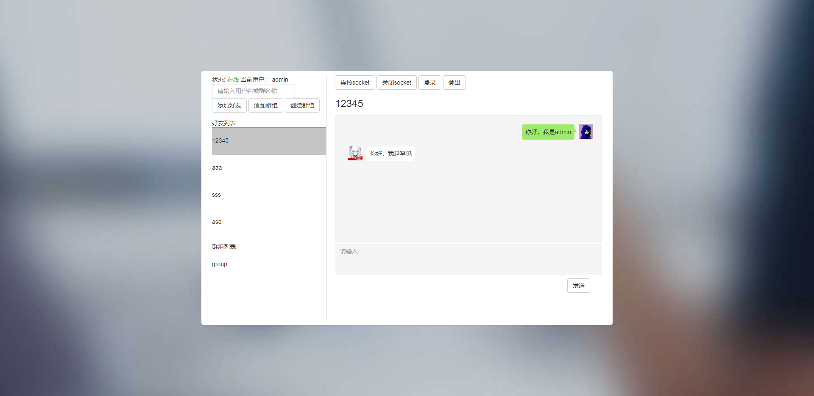

# chatsite

结构：Django+websocket+AJAX

计算机网络课程设计，功能有：一对一聊天、群聊、添加好友、添加群组、创建群组、登录和注册、连接和断开websocket，使用mysql存储聊天记录，支持读取聊天记录。



## 使用

### 目录结构

```
│  manage.py
│
├─chat01
│  │  admin.py
│  │  apps.py
│  │  consumers.py
│  │  models.py
│  │  tests.py
│  │  views.py
│  │  __init__.py
│  │
│  ├─migrations
│  │      0001_initial.py
│  │      __init__.py
│  │
│  ├─static
│  │  ├─css
│  │  │      animate.min.css
│  │  │      bootstrap.min.css
│  │  │      bootstrap.min.css.map
│  │  │      font-awesome.min.css
│  │  │      index.css
│  │  │      login_style.css
│  │  │      register_style.css
│  │  │      style.css
│  │  │
│  │  ├─fonts
│  │  │      fontawesome-webfont.eot
│  │  │      fontawesome-webfont.svg
│  │  │      fontawesome-webfont.ttf
│  │  │      fontawesome-webfont.woff
│  │  │      fontawesome-webfont.woff2
│  │  │      FontAwesome.otf
│  │  │
│  │  ├─img
│  │  │  │  background.jpg
│  │  │  │
│  │  │  └─head
│  │  │          head_12345.jpg
│  │  │          head_aaa.jpg
│  │  │          head_admin.jpg
│  │  │          head_sss.jpg
│  │  │
│  │  ├─js
│  │  │      bootstrap.min.js
│  │  │      jquery.min-3.6.2.js
│  │  │
│  │  └─plugins
│  └─templates
│          index.html
│          login.html
│          register.html
│
└─chatsite
       asgi.py
       routings.py
       settings.py
       urls.py
       wsgi.py
       __init__.py
```

### 拷贝项目到本地

```
git clone https://github.com/pang-juzhong/chatsite.git
```

### 创建数据库

```
创建一个叫做chatsite的数据库

cd 你的项目位置

python manage.py makemigrations
python manage.py migrate
```

### 安装依赖

```
cd 你的项目位置

pip install -r requirements.txt
pip install -U channels["daphne"]
```

### 配置数据库

在setting.py中，找到DATABASES，配置自己的数据库

### 配置CHANNEL_LAYERS

在setting.py中，修改自己redis，也可以用非生产环境的CHANNEL_LAYERS（不推荐）

```python
#非生产环境
# CHANNEL_LAYERS = {
#     "default": {
#         "BACKEND": "channels.layers.InMemoryChannelLayer"
#     }
# }

#redis
CHANNEL_LAYERS = {
    "default": {
        "BACKEND": "channels_redis.core.RedisChannelLayer",
        "CONFIG": {
            "hosts": [("192.168.31.38", 6379)],
        },
    },
}
```

### 运行项目

```
cd 你的项目位置

#运行
python manage.py runserver 8000
```

